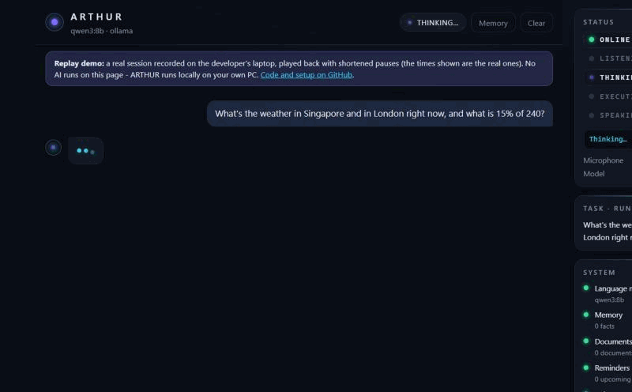
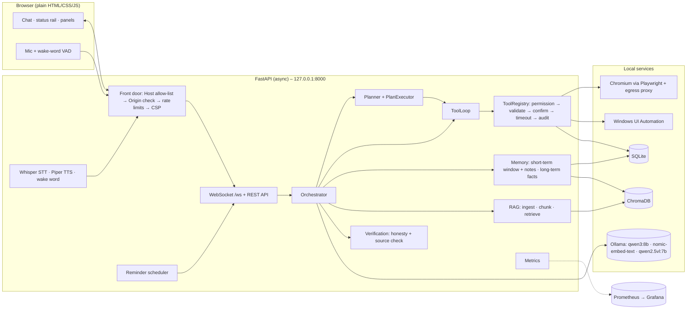
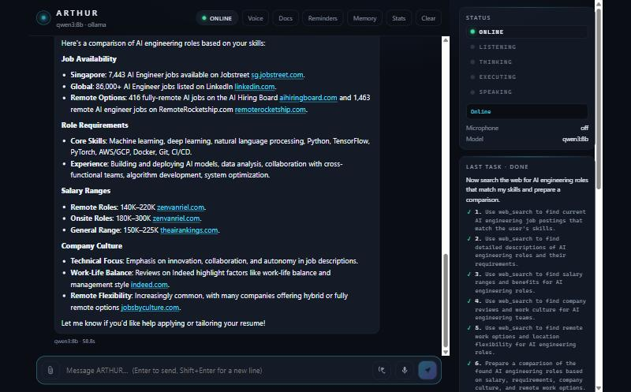
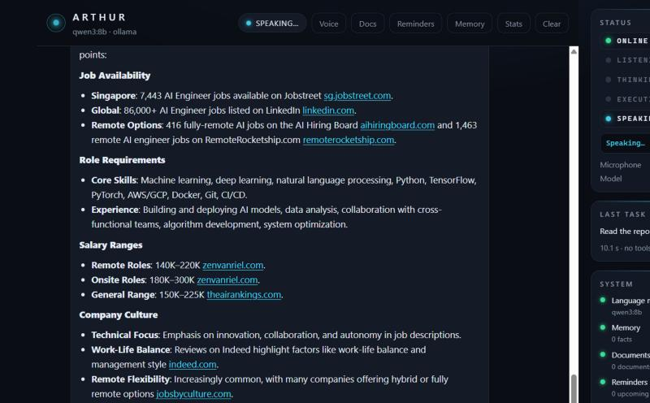
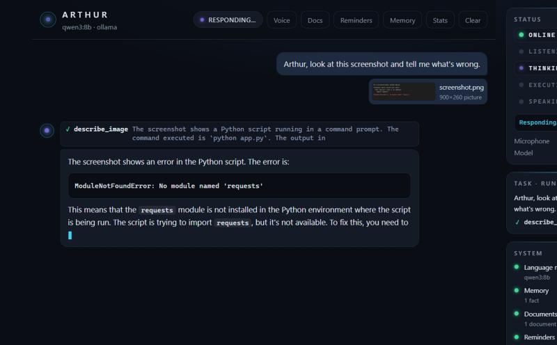
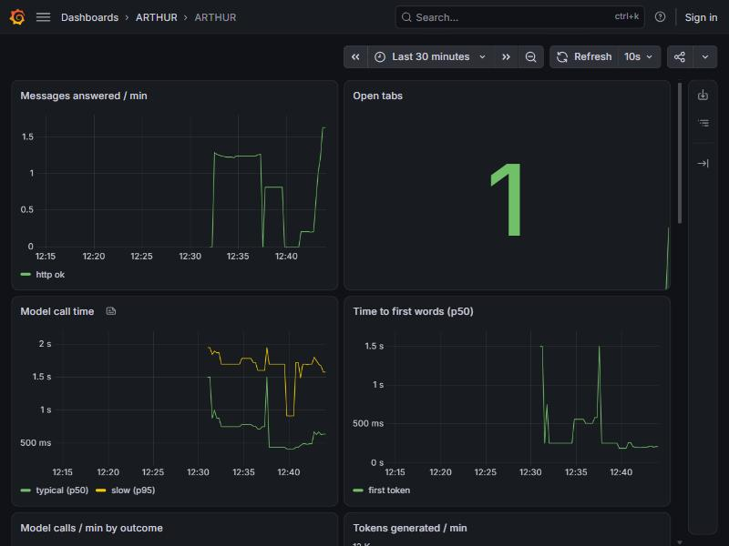

# ARTHUR – Personal Multimodal AI Agent

**A local-first AI assistant that listens, sees, reads, searches, remembers and acts – and asks
before it does anything that matters.** It runs on your own computer: the language model
(qwen3 8B via Ollama), speech recognition, the voice, the vision model and every byte of memory
stay on the machine. Only web searches go online, and only when needed.

**▶ [Try the replay demo in your browser](https://vishnuvarthant1126-bit.github.io/ARTHUR/)** –
ARTHUR's real interface playing back a real recorded session (no AI runs on that page; ARTHUR
itself runs locally on your PC).



> Built in 12 sessions and 30 phases as a learning and portfolio project:
> - **Size:** 11,900 lines of Python, 2,300 lines of plain HTML/CSS/JS.
> - **Tests:** 799 automated tests, 91 % coverage.
> - **Measured:** every performance and safety claim below was measured on a laptop with an
>   8 GB GPU (RTX 5060). The numbers are in `docs/`.

**Contents** ·
[Overview](#1-overview) · [Features](#2-features) · [Architecture](#3-architecture) ·
[Tech stack](#4-technology-stack) · [Installation](#5-installation) ·
[Configuration](#6-configuration) · [Running locally](#7-running-locally) ·
[Docker](#8-docker-setup) · [API](#9-api-documentation) · [Tools](#10-tool-architecture) ·
[Memory](#11-memory-architecture) · [RAG](#12-rag-architecture) · [Security](#13-security-model) ·
[Testing](#14-testing) · [Performance](#15-performance) · [Screenshots](#16-screenshots) ·
[Demo video](#17-demo-video-instructions) · [Future improvements](#18-future-improvements)

---

## 1. Overview

ARTHUR is an **agent**, not a chatbot. For every message it decides whether to answer
directly, use one of its 27 tools, or make a plan of several steps. It then checks its own
answer before you see it.

The final demo (full script and recorded run in [docs/DEMO.md](docs/DEMO.md)):

| You | ARTHUR |
|---|---|
| "Hey Arthur." | "Yes?" (wake word, all local) |
| "Check my documents and find my latest resume." | `find_files` → the 2026 resume, not the 2025 one (2.5 s) |
| "Summarize my technical skills." | `read_file` → skills, projects, experience (4.9 s) |
| "Now search the web for AI engineering roles that match my skills and prepare a comparison." | a 6-step plan, 7 web searches, a cited comparison of jobs, requirements, salaries, culture (59 s) |
| "Save the report." / "Save it in my ARTHUR reports folder." / "yes" | asks where and waits for your yes, then writes `Documents\ARTHUR\reports\ai_engineering_jobs_report.md` |
| "Read the report to me." | reads it aloud with a local neural voice |

What it is **not**: it never runs shell commands, never types into a window it didn't open, never
buys, pays or logs in on its own, and never takes an action at confirmation level without your
explicit "yes". See [Security](#13-security-model).

## 2. Features

**Talking to it**
- **Text chat** with streamed answers, Markdown, a stop button and conversation history.
- **Voice:** push-to-talk or hands-free "Hey Arthur" (19/20 detected, 0/32 false alarms).
  Speech recognition with Whisper, spoken replies with Piper, all on the CPU.
- **Attachments:** paste a screenshot, drop a PDF or picture, then ask *"what's wrong here?"*
  or *"explain the important parts"*.
- **Status rail:** five lamps (ONLINE · LISTENING · THINKING · EXECUTING · SPEAKING), the
  current task step by step, and the health of every part of the system.

**What it can do**
| Area | Tools (permission level) |
|---|---|
| Everyday | `calculator` (0, no `eval`), `current_time` (0), `weather` (0, Open-Meteo) |
| Memory | `search_memory` (0), `delete_memory` (2); "remember…" / "forget…" in plain words |
| Your documents (RAG) | `document_search`, `list_documents` (0); answers cite `[file.pdf, p. 2]` |
| Files on your PC | `find_files`, `list_folder`, `read_file` (0), `save_file` (2) – only folders you allow |
| Web | `web_search`, `read_webpage` (0) – DuckDuckGo or SearXNG, cited links |
| Browser | `browser_open`, `browser_find_text` (0), `browser_click`, `browser_type` (1→2→3 per action) |
| Desktop (Windows) | `open_app` (1), `read_window` (0), `click_control`, `type_text`, `press_key` (2) – Notepad, Calculator, Explorer |
| Vision | `describe_image` (0), `look_at_screen` (1 window / 2 whole screen) – qwen2.5-VL |
| Reminders | `set_reminder` (1), `list_reminders` (0), `cancel_reminder` (2) – "remind me at 5 pm…" |

**How it thinks**
- **Planning:** a multi-part request becomes 2–6 steps; each step runs a bounded tool loop
  and is retried once.
- **Parallel lookups:** read-only lookups in one step run at the same time; actions never do.
- **Long conversations:** older messages are condensed into short notes, written while you pause.
- **Honesty checks:**
  - a claimed action ("I deleted it") without a tool call gets a visible correction;
  - a fake permission question written by the model is flagged;
  - every cited page or link is checked against what was actually read.

**Running it**
- **Monitoring:** Prometheus metrics, a built-in stats page and a Grafana dashboard.
- **Docker Compose:** ARTHUR + Prometheus + Grafana, every port on 127.0.0.1.
- **Graceful failures:** every failure from the spec is handled and tested, from "Ollama is off"
  to a broken database ([docs/FAILURES.md](docs/FAILURES.md)).

## 3. Architecture



**One message, step by step:**
1. The front door checks Host, Origin and rate limit.
2. The orchestrator handles a pending yes/no or a "remember/forget" directly.
3. Otherwise it recalls memories and document passages in parallel, and describes attached
   pictures with the vision model.
4. It builds the prompt, ordered for the prompt cache: static system text → tool descriptions
   → history (+ notes) → newest message with a `<context>` block.
5. The ToolLoop or the planner runs; every tool call goes through the registry.
6. The answer is streamed, then checked (honesty, sources) and stored in the conversation.

Details: [docs/ARCHITECTURE.md](docs/ARCHITECTURE.md), [docs/AGENT.md](docs/AGENT.md).

## 4. Technology stack

| Layer | Technology | Why |
|---|---|---|
| Language model | **qwen3:8b** via **Ollama** (`think: false`); any OpenAI-compatible API as fallback | strong tool calling at 8B, fits 8 GB VRAM |
| Embeddings | **nomic-embed-text** (task prefixes) | small, good retrieval quality |
| Vision | **qwen2.5vl:7b** | reads screenshots and receipts locally |
| API | **FastAPI**, uvicorn, Pydantic v2, pydantic-settings, async httpx | typed, async, automatic OpenAPI docs |
| Storage | **SQLite** (SQLAlchemy 2), **ChromaDB** (embedded) | zero-setup, local |
| Speech | **faster-whisper** (small / base.en, int8, CPU), **Piper** | GPU stays free for the LLM |
| Browser | **Playwright** Chromium + own egress proxy | real pages, every connection checked |
| Desktop | **pywinauto** (UI Automation), Windows messages, Shell COM | no keystrokes, no pixel guessing |
| Frontend | plain HTML/CSS/JS, no build step, no CDN | strict Content-Security-Policy |
| Observability | prometheus-client, Prometheus, Grafana, structlog | numbers instead of guesses |
| Quality | pytest (+asyncio, cov), ruff, Locust, pip-audit | 799 tests, 88 % coverage gate |
| Deployment | Docker, Docker Compose | repeatable setup |

## 5. Installation

Requirements: Windows 11 (desktop control is Windows-only; everything else also runs on Linux
in Docker), **Python 3.12**, [Ollama](https://ollama.com), Git. A GPU with 8 GB is enough.

```powershell
git clone <your fork URL> arthur
cd arthur
py -3.12 -m venv .venv
.venv\Scripts\Activate.ps1
pip install -r requirements-dev.txt
copy .env.example .env

ollama pull qwen3:8b
ollama pull nomic-embed-text
ollama pull qwen2.5vl:7b                 # optional: vision (~6 GB)
python -m playwright install chromium    # optional: browser tools
```
Piper voices go into `data/voices` (`en_GB-alan-medium.onnx` + `.onnx.json`, from the Piper
voices list); Whisper downloads its model on first use. macOS/Linux: `python3.12 -m venv .venv
&& source .venv/bin/activate` (desktop control is then switched off automatically).

## 6. Configuration

Everything is in `.env` (template: [.env.example](.env.example), every line commented). The
most important settings:

| Setting | Default | Meaning |
|---|---|---|
| `LLM_PROVIDER` / `LLM_FALLBACK_PROVIDER` | `ollama` / – | main and backup model provider (`openai_compat` + `OPENAI_COMPAT_*`) |
| `OLLAMA_MODEL`, `OLLAMA_KEEP_ALIVE` | `qwen3:8b`, `30m` | chat model; how long it stays in GPU memory |
| `ALLOWED_DIRECTORIES` | `Documents\ARTHUR` | the ONLY folders the file tools may touch (`;`-separated) |
| `TOOLS_AUTO_APPROVE_MAX_LEVEL` | `1` | levels above this always ask (level 3 is always refused) |
| `BROWSER_ENABLED`, `COMPUTER_USE_ENABLED`, `VISION_ENABLED` | `true` | switch whole features off |
| `COMPUTER_ALLOWED_APPS` | `notepad;calculator` | add `explorer` if you want it |
| `MEMORY_MIN_SCORE`, `RAG_MIN_SCORE` | `0.55`, `0.58` | relevance thresholds, measured with `scripts/calibrate_*.py` |
| `HISTORY_SUMMARY_DELAY_SECONDS` | `15` | when notes on long chats are written |
| `ALLOWED_HOSTS`, `RATE_LIMIT_*` | – | front-door security (see SECURITY.md) |

## 7. Running locally

```powershell
.venv\Scripts\Activate.ps1
uvicorn app.main:app --reload
```
- Chat: **http://127.0.0.1:8000**. Use Chrome or Edge for the microphone.
- API docs (Swagger): http://127.0.0.1:8000/docs
- Live stats: http://127.0.0.1:8000/dashboard.html

The models load in the background at start-up, so the first answer takes ~0.6 s instead of ~12 s.

**Windows shortcut:** double-click `start_arthur.bat` (it does nothing if ARTHUR is already
running). To start ARTHUR at every login, put a shortcut to it in the Startup folder
(Win + R → `shell:startup`); remove it there or in Task Manager → Startup apps.

### From your phone – privately, with Tailscale
ARTHUR has no login, so it must **never** be opened to the internet. To use it from your
own phone or laptop, put your devices in a private Tailscale network instead:
1. Install [Tailscale](https://tailscale.com/download) on the PC and on the phone, signed in
   with the same account.
2. On the PC: `tailscale serve --bg 8000` → `https://<pc>.<tailnet>.ts.net` (enable "Serve"
   once when Tailscale asks).
3. In `.env`: `ALLOWED_HOSTS=<pc>.<tailnet>.ts.net`, then restart ARTHUR.

Only devices signed in to your Tailscale account can open the address, and HTTPS makes the
phone's microphone work. To switch it off: `tailscale serve --https=443 off`.

## 8. Docker setup

```powershell
docker compose up -d --build     # ARTHUR :8000 · Grafana :3000 · Prometheus :9090
docker compose down
```
- **Containers:** ARTHUR, Prometheus and Grafana. Every port is published on **127.0.0.1 only**.
- **What stays outside:** Ollama keeps running on Windows (it needs the GPU), and the container
  reaches it as `host.docker.internal`. Desktop-app control is off in the container; it needs
  Windows.
- **Data:** the container keeps its own memory in a Docker volume.
- **Verified:** answers are as fast as on Windows.
- **Monitoring only** (ARTHUR on Windows, Prometheus + Grafana in Docker):
  `docker compose -f deploy/docker-compose.observability.yml up -d`.

Results of the first real run, and the two bugs it found: [docs/DOCKER.md](docs/DOCKER.md).

## 9. API documentation

Interactive OpenAPI docs at `/docs`. All errors share one shape:
`{"error": {"type": "llm_unavailable", "message": "…"}, "request_id": "…"}`.

| Endpoint | Purpose |
|---|---|
| `WS /ws?session_id=…` | streaming chat. In: `chat` (+ `attachments`), `stop`, `clear`, `ping`. Out: `session`, `status`, `tool`, `plan`, `step`, `token`, `confirmation`, `done`, `error`, `reminder` |
| `POST /chat` | one message → one reply (`response`, `tools_used`, `latency_ms`) |
| `POST /attachments` | upload a picture or document for the next message → id |
| `GET /health` · `GET /status` | model reachable? · every part ok / off / problem |
| `GET/POST/DELETE /memories`, `GET /memories/search?q=` | long-term memory |
| `POST/GET/DELETE /documents`, `GET /documents/search?q=` | document store (RAG) |
| `GET/POST/DELETE /reminders` | reminders |
| `POST /voice/transcribe` · `POST /voice/speak` · `GET /voice/voices` · `POST /voice/wake` | speech in, speech out, wake word |
| `POST /vision/describe` | ask about an uploaded picture |
| `GET /tools` · `POST /tools/{name}/run` · `GET /audit` | tool catalogue, direct calls (same permission rules), audit log |
| `GET /metrics` · `GET /metrics/summary` | Prometheus metrics, stats-page summary |

## 10. Tool architecture

Every tool is a class with:
- a name and a description;
- a **Pydantic input model**, which becomes the JSON schema the model sees;
- a **permission level** and a timeout.

Some tools also mark themselves `parallel_safe`. The model can only *ask* for a tool. The
**ToolRegistry** decides:

```
lookup ─► policy (blocked? level 3?) ─► validate arguments ─► level of THIS call
       ─► level ≥ 2 and not confirmed? → preview + "Reply yes" (the model can never confirm)
       ─► run with timeout ─► any exception → error result ─► audit log (secrets masked) ─► metrics
```

| Level | Meaning | Behaviour |
|---|---|---|
| 0 | read-only | runs |
| 1 | low-risk, reversible | runs (`TOOLS_AUTO_APPROVE_MAX_LEVEL`) |
| 2 | changes something | shows exactly what will happen, waits for a short, pure "yes" (expires after 5 min) |
| 3 | highly sensitive (pay, passwords, card fields) | always refused |

Some tools raise their level per call. A browser click on "Search" runs, "Buy now" asks,
"Pay" is refused. Plans never get confirmation-level tools unless your message asks for an
action.

## 11. Memory architecture

| | Short-term (the conversation) | Long-term (facts) |
|---|---|---|
| Where | server RAM, per browser session | SQLite (the record) + ChromaDB (the vector) |
| Written when | every turn | only on an explicit "remember…" (secrets refused) |
| Read how | a window of recent messages that fits the context. The start jumps in steps so the prompt cache survives; older messages become short notes | semantic search on every message; ranked, dated, capped; the newer fact wins a conflict |
| Removed | Clear, or after 4 h idle | "forget…" → shows the fact → "yes" |

## 12. RAG architecture

```
upload (PDF/DOCX/TXT/MD/CSV ≤ 20 MB) ─► text per page ─► clean ─► chunks (1,000 chars, 150 overlap)
   ─► nomic-embed-text ─► ChromaDB "documents" (+ file, page) · SQLite record · SHA-256 dedupe
every question ─► passages with similarity ≥ 0.58 ─► in the <context> block as DATA
               ─► answer cites [handbook.pdf, p. 2] ─► source check: was that page really read?
attached document ─► whole pages up to 8,000 chars travel with that one message
```
- **Ignoring planted instructions:** the sample handbook has a planted instruction on page 4,
  and ARTHUR ignores it. Document text is data, never instructions.
- **No guessing:** "not in your documents" only comes after a real search.

## 13. Security model

Full threat → defence → test table: [docs/SECURITY.md](docs/SECURITY.md).

- **Incoming:**
  - ARTHUR listens on 127.0.0.1 only.
  - Host allow-list (DNS rebinding → 421).
  - Origin check (other websites → 403).
  - Rate limits (429).
  - A strict Content-Security-Policy.
- **Outgoing:**
  - Public addresses only, and the *checked* address is the one used (DNS pinning).
  - The browser's traffic goes through ARTHUR's own egress proxy.
- **Agent:**
  - Every action goes through the registry: levels, confirmation and audit.
  - No shell; no keystrokes into other windows; file tools are sandboxed to allowed folders.
  - Tool results, web pages, documents and image text are DATA, never instructions.
  - Honesty and source checks run on every answer.
- **Secrets:** never stored, typed or logged (masked by key and value); `.env` and `data/` are
  never committed.
- 110 attack tests in `tests/security` (including "no shell anywhere in the code"); dependencies checked with `pip-audit`.

## 14. Testing

```powershell
pytest                # 799 tests, ~60 s; live tests skip when Ollama is off
pytest --cov          # coverage 91 % (gate: 88 %)
pytest tests/security # the attack tests
ruff check . ; ruff format --check .
```
- Fakes make the tests fast and deterministic: `FakeLLM` with scripted tool calls,
  `FakeEmbeddings`, `FakeVision`, a fake desktop, a local test website, offline HTTP clients.
- Load tests with Locust: ARTHUR's own code handles ~400 req/s; the GPU allows ~1 answer/s.

More: [docs/TESTING.md](docs/TESTING.md), [docs/LOAD_TESTS.md](docs/LOAD_TESTS.md),
[docs/FAILURES.md](docs/FAILURES.md).

## 15. Performance

Measured on an RTX 5060 Laptop (8 GB). How each number was found and fixed:
[docs/PERFORMANCE.md](docs/PERFORMANCE.md).

| Situation | Before | After |
|---|---|---|
| First message after start | 11–13 s | **0.6 s** (models warmed up in the background) |
| Small talk | 0.9–1.3 s | **0.4–0.8 s** |
| Question with a tool | 2.7–3.4 s | **~1.2 s** |
| Long conversation (turn 22+) | 3.6 s | **1.6 s** (prompt-cache-friendly order, history in steps) |
| "Ollama is off", repeated | 10 s | **2 s** (circuit breaker) |
| A picture question | – | ~10 s warm, ~30 s cold (vision and chat model share the GPU) |

## 16. Screenshots

| | |
|---|---|
|  |  |
| A planned web research with cited sources; the Task card lists the plan steps | "Read the report to me": the SPEAKING lamp is on while Piper reads |
|  |  |
| A pasted terminal screenshot: the vision model reads it, ARTHUR finds the missing module | Grafana dashboard fed by ARTHUR's `/metrics` (Docker setup) |

## 17. Demo video instructions

1. **Prepare:**
   - Start ARTHUR (`uvicorn app.main:app`) and wait ~15 s for the warm-up.
   - Open **http://127.0.0.1:8000 in Chrome**; the microphone needs a real browser.
   - Make fictional sample files: `python scripts/make_sample_files.py`.
   - Point `ALLOWED_DIRECTORIES` at `Documents\ARTHUR` so no real files can appear on screen.
2. **Record:**
   - Windows: **Win + Alt + R** (Xbox Game Bar), or OBS Studio for screen + microphone.
   - Turn on hands-free mode (the ear button) and set the Voice panel to *Speak replies: Always*.
3. **Follow the script** in [docs/DEMO.md](docs/DEMO.md):
   - wake word → find resume → skills → web comparison → save (say "yes") → read aloud;
   - optionally add a pasted screenshot and the Stats / Grafana pages.
   - Expect ~3 minutes; the web research takes about a minute.
4. **Before publishing:** check that no real names, files or keys are visible.

## 18. Future improvements

- **Better local models:** a 14B model or a dedicated function-calling model when VRAM allows,
  and a vision model that can stay loaded next to the chat model.
- **Real OCR** for scanned PDFs; tables and images inside documents.
- **Accounts:** login and HTTPS before ARTHUR is ever reachable beyond 127.0.0.1.
- **Persistence:** conversations survive a restart (they are RAM-only today).
- **Agent:** cache-friendly tool groups instead of all 27 tools on every message; a critic
  pass for long reports; the planner learning from failed steps.
- **Desktop:** more allowed apps, each with its own rules (only on Windows).
- **Deployment:** a lock file with exact package versions; CI on GitHub Actions running the test
  suite and `pip-audit`; the optional Docker browser build and SearXNG profile (written, not run yet).

---

**How it was built:** one session per day, each phase explained, tested and committed
([docs/sessions](docs/sessions)).
**Contributing:** [CONTRIBUTING.md](CONTRIBUTING.md).
**Licence:** [MIT](LICENSE) © 2026 Vishnu Varthan Thiagarajan.
